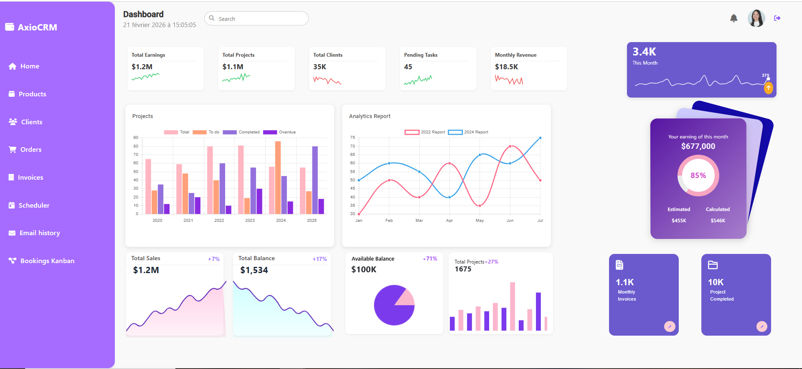
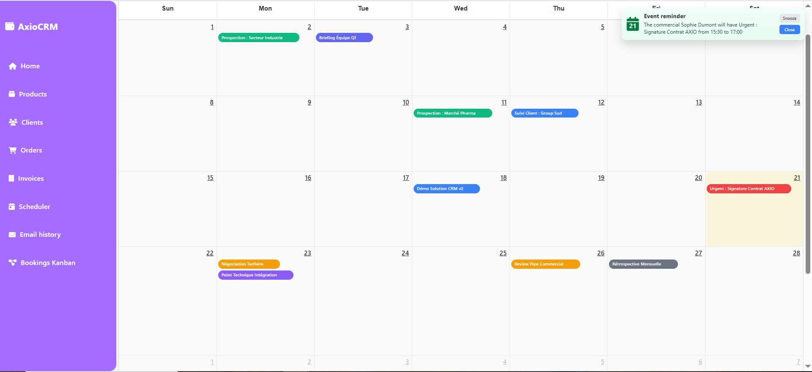
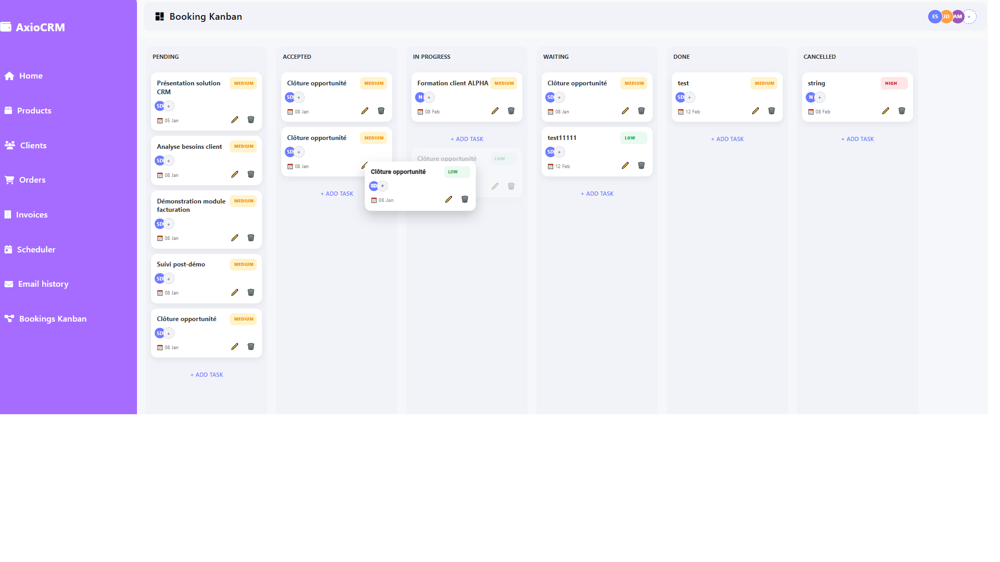
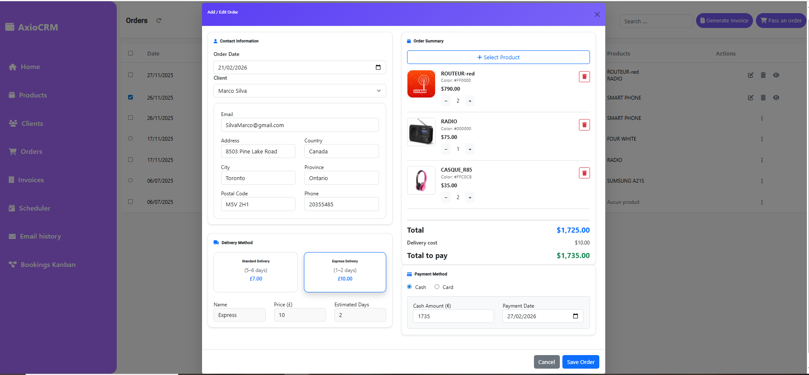
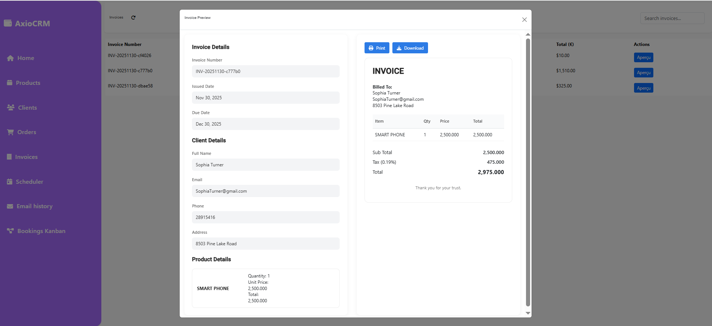
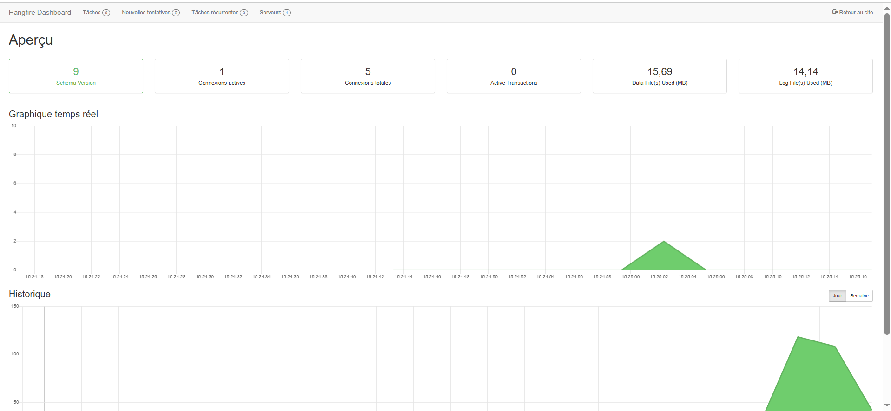

# AXIOCRM

AXIOCRM is a modular, automation-driven CRM system designed to streamline sales workflows, enhance team productivity, and improve business visibility.

Built from scratch with a focus on scalability, clean architecture and real-time communication.

## Tech Stack

**Backend:** ASP.NET Core Web API, JWT, Hangfire, SignalR, SQL Server.
**Frontend:** Angular 17, TypeScript, Modular Architecture.

## 📸 Visual Showcase

### 🔐 Secure Authentication & Social Login

*Multi-method authentication system including standard **JWT (JSON Web Tokens)** and **Google OAuth2** integration for a seamless user experience.*

### 📊 Dashboard Analytics

*Dynamic analytics tracking earnings, projects, and client growth.*

### 📅 Smart Scheduler & Real-time Alerts

*Meeting management featuring **SignalR** real-time toast notifications triggered by **Hangfire**.*

### 📋 Sales Pipeline (Kanban)

*Visual opportunity tracking with drag-and-drop workflow.*

### 📄 Order Management & Invoicing

*Comprehensive order processing with automated PDF invoice generation.*

### ⚙️ Automation Monitoring

*Hangfire dashboard tracking background jobs for email reminders and AI training.*

## Core Features

* **Secure authentication (JWT)**
* **Client, product and order management**
* **Automated invoice generation** (PDF export & print)
* **Sales pipeline** with Kanban drag & drop
* **Smart meeting scheduler**
* **Automatic email reminders** before meetings
* **Real-time toast notifications** for administrators
* **Centralized email tracking** with date filtering
* **Dashboard analytics**
* **AI module** (in progress)

## Architecture Principles

* Clean separation between API & UI
* Modular structure
* Event-driven notifications
* Background job processing
* Scalable design for future AI integration

## 🎯 Vision

The goal of AXIOCRM is not just CRUD operations, but workflow automation and intelligent business management. Currently expanding toward AI-powered predictive insights.
