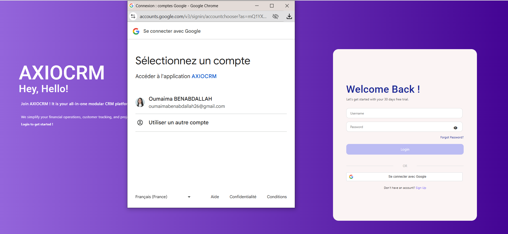
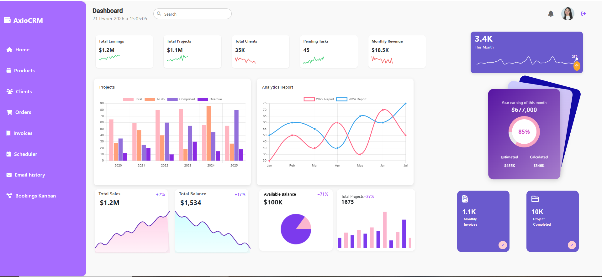
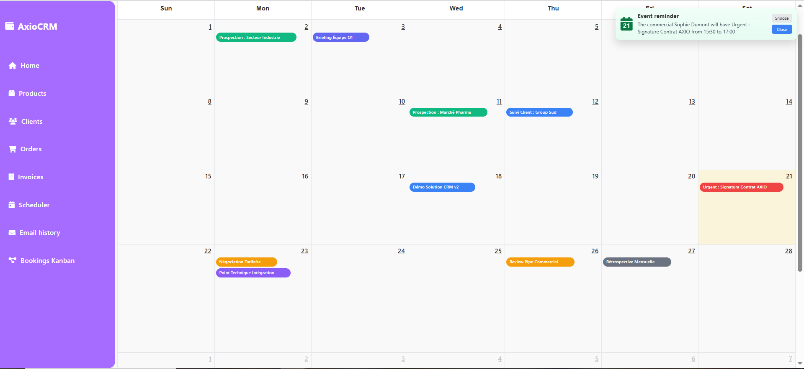
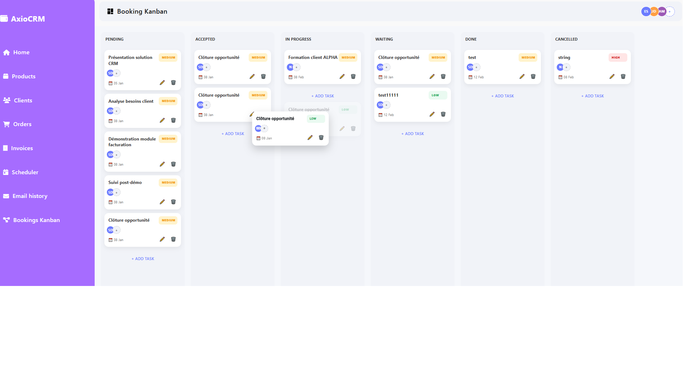
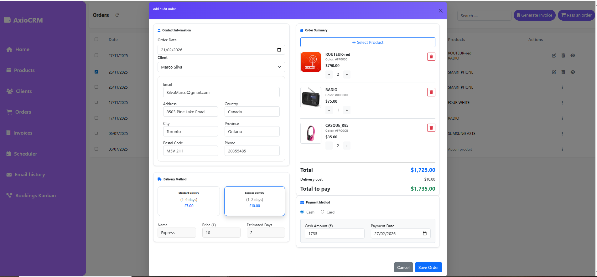
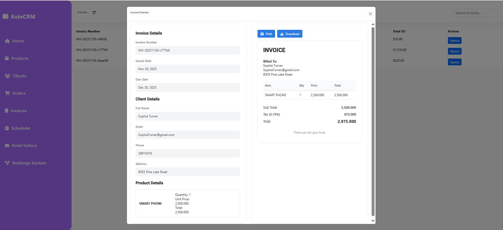
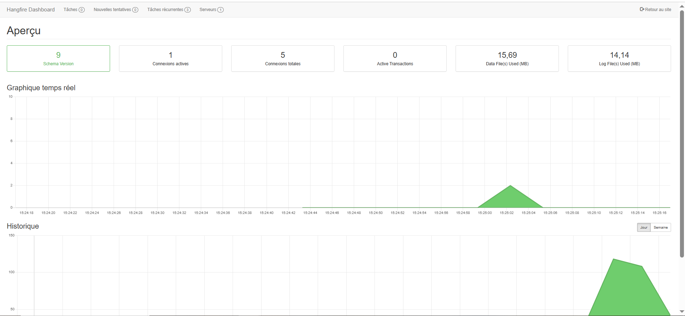
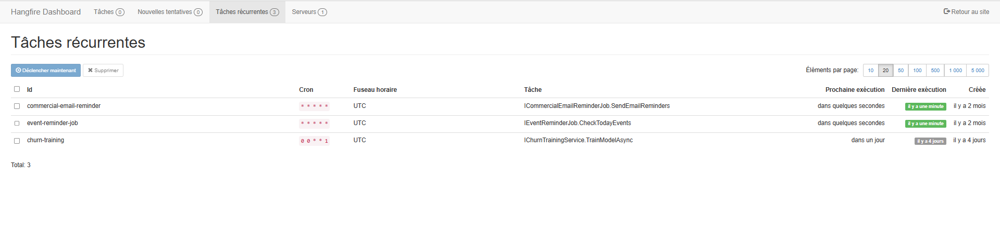

# AXIOCRM

AXIOCRM is a modular, automation-driven CRM system designed to streamline sales workflows, enhance team productivity, and improve business visibility.

Built from scratch with a focus on **Clean Architecture**, **CQRS**, **DDD**, and real-time communication.

## Tech Stack

**Backend:** ASP.NET Core Web API, JWT, Hangfire, SignalR, SQL Server.

**Frontend:** Angular 17, TypeScript, Modular Architecture.

**Architecture:** Clean Architecture · CQRS (MediatR) · 

Domain-Driven Design (Aggregates, Value Objects, Domain Events)

**Testing:** xUnit · TDD approach on core business logic

**DevOps:** Docker (local environment)

## Architecture Overview

The solution follows Clean Architecture principles with 
strict layer separation:

AXIOCRM/
├── AXIOCRM.Domain/                      # Entities, Aggregates, 

│                                        Value Objects, Domain Events

├── AXIOCRM.Application/     # CQRS Commands & Queries 

│                              (MediatR), DTOs, Interfaces

├── AXIOCRM.Infrastructure/  # EF Core, SQL Server, 

│                              Email, Hangfire

├── AXIOCRM.API/             # Controllers, Middleware, 

│                              SignalR Hubs

└── AXIOCRM.Tests/           # xUnit unit tests per module

## Core Features

- Secure authentication (JWT & Google OAuth2)
- Client, product and order management
- Automated invoice generation (PDF export & print)
- Sales pipeline with Kanban drag & drop
- Smart meeting scheduler with automated email reminders
- Real-time toast notifications via SignalR + Hangfire
- Centralized email tracking with date filtering
- Dashboard analytics
- AI module (in progress)

## 📸 Visual Showcase

### 🔐 Secure Authentication & Social Login
 
*Multi-method authentication system including standard **JWT (JSON Web Tokens)** and **Google OAuth2** integration for a seamless user experience.*

### 📊 Dashboard Analytics

*Dynamic analytics tracking earnings, projects, and client growth.*

### 📅 Smart Scheduler & Real-time Alerts

*Meeting management featuring **SignalR** real-time toast notifications triggered by **Hangfire**.*

### 📋 Sales Pipeline (Kanban)

*Visual opportunity tracking with drag-and-drop workflow.*

### 📄 Order Management & Invoicing

*Comprehensive order processing with automated PDF invoice generation.*

### ⚙️ Automation Monitoring

*Hangfire dashboard tracking background jobs for email reminders and AI training.*

## 🎯 Vision

AXIOCRM is not a CRUD demo. It is a real SaaS-oriented 
product built to production standards  clean layers, 
tested business logic, automated workflows, and a 
roadmap toward AI-powered insights.
